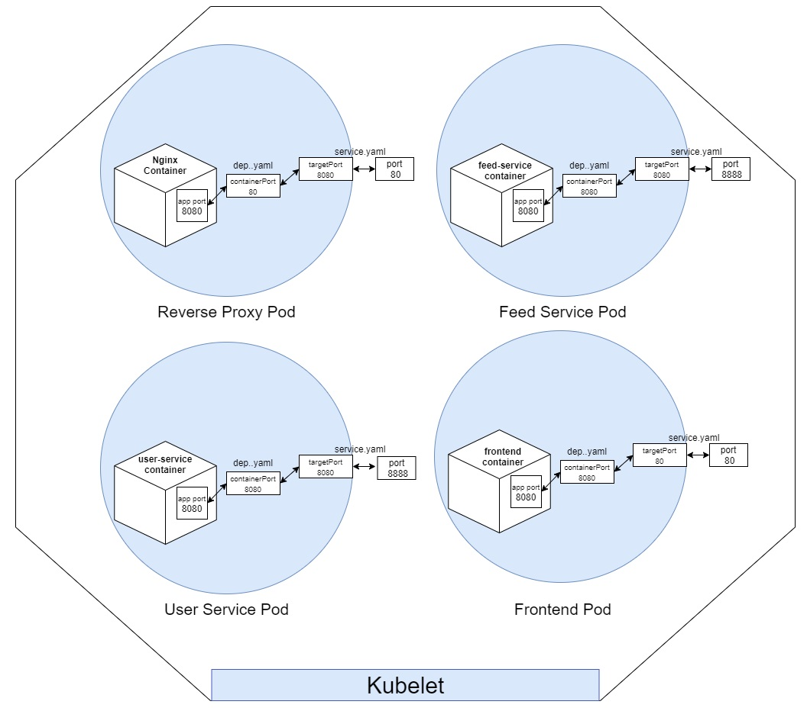

Table of Contents
=================
<!--ts-->
   * [Udagram Image Filtering Application](#udagram-image-filtering-application)
   * [Demo](#demo)
   * [Project Architecture Diagram](#project-architecture-diagram)
   * [Kubelet - Pod Diagram](#kubelet---pod-diagram)
   * [File Structure](#file-structure)   
   * [What to do](#what-to-do)

# Udagram Image Filtering Application

Udagram is a simple cloud application developed alongside the Udacity Cloud Engineering Nanodegree. It allows users to register and log into a web client, post photos to the feed.

The main project purpose was to split [a monolithic project](https://github.com/udacity/nd9990-c3-microservices-exercises/tree/master/project) into microservices.


### The project is split into four parts:
1. Frontend - Angular web application built with Ionic Framework
2. Backend RESTful USER API - Node-Express application
3. Backend RESTful FEED API - Node-Express application
4. Reverse Proxy - Nginx

### Technologies and concepts used:
1. AWS Simple Storage Service (S3) as File Storage
2. Elastic Kubernetes Service (EKS) as Kubernetes Manager
3. AWS RDS - PostgreSQL
4. Docker and Dockerhub
5. Nginx as Reverse Proxy/Load Balancer
6. Travis as CI Tool
7. Angular and Express Frameworks 

### Demo


### Project Architecture Diagram


### Kubelet - Pod Diagram



#### File Structure
```
root  
│
└───K8s: All deployment, service and service secrets files
│   
└───Others: README.md stuffs
│   
└───screenshots: same screenshots about state of application
│   
└───services
│   │   
│   └───feed-service: which is used to serve feeds
│   └───frontend-service: which is used to serve angular/ionic app
│   └───reverseproxy-service: load balancer
│   └───user-service: which is used to manage sign in/out and authentication
```

# What to do
- Add a image processing / resizer service
- Upate nginx load balancer for 404 Not Found request
- Upgrade logging system with best practices
- Secure AWS resources for least-privileged access for IAM roles
- Create dependency graph of application services and AWS resources
- Add self healing end points
- Update of k8s' pods when docker container in dockerhub is updated automatically